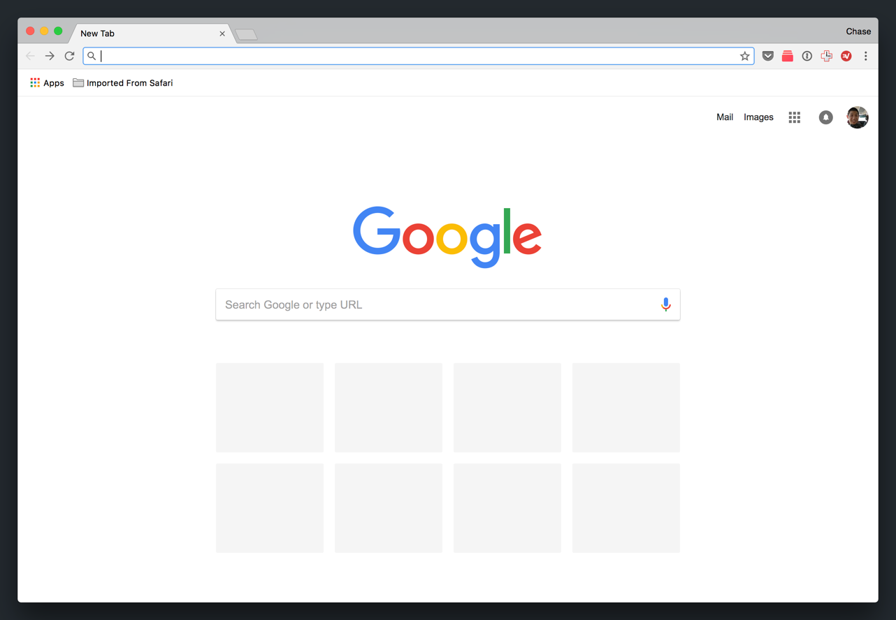
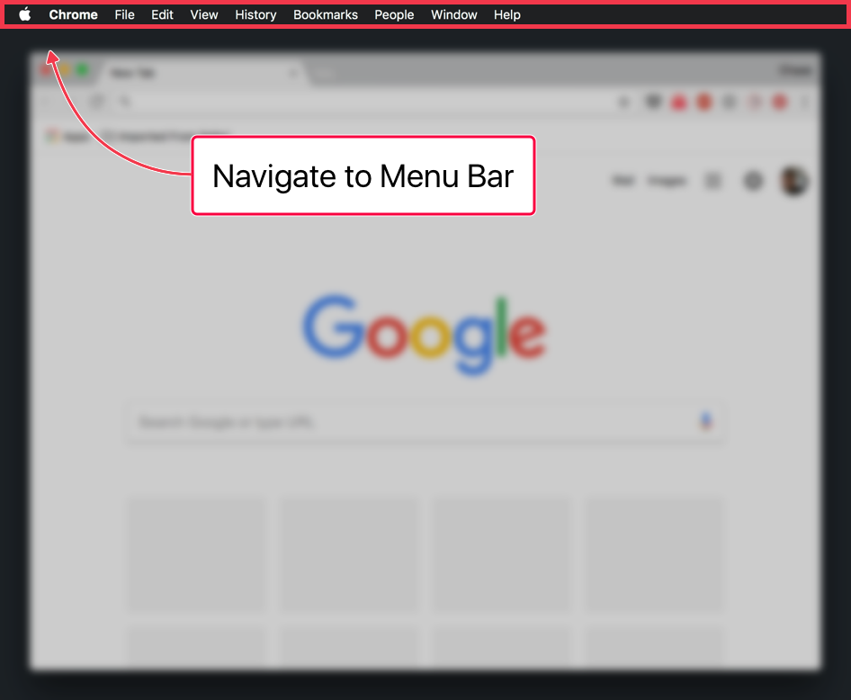
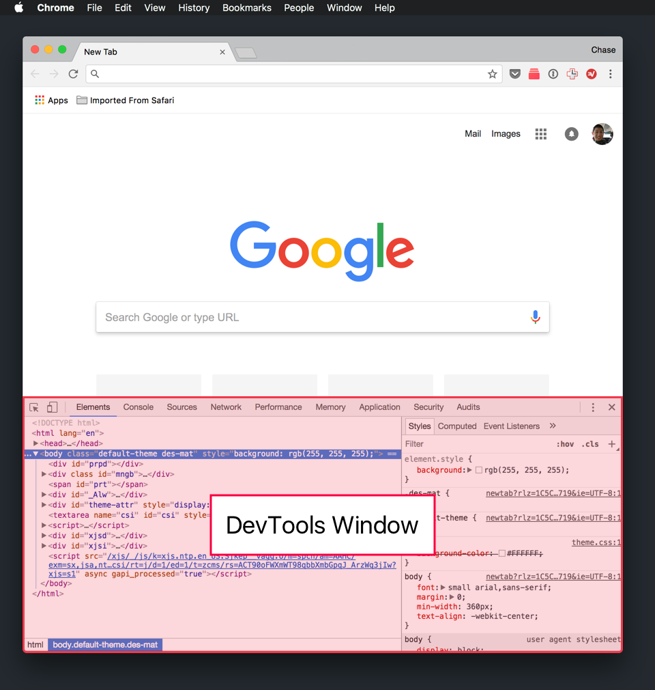
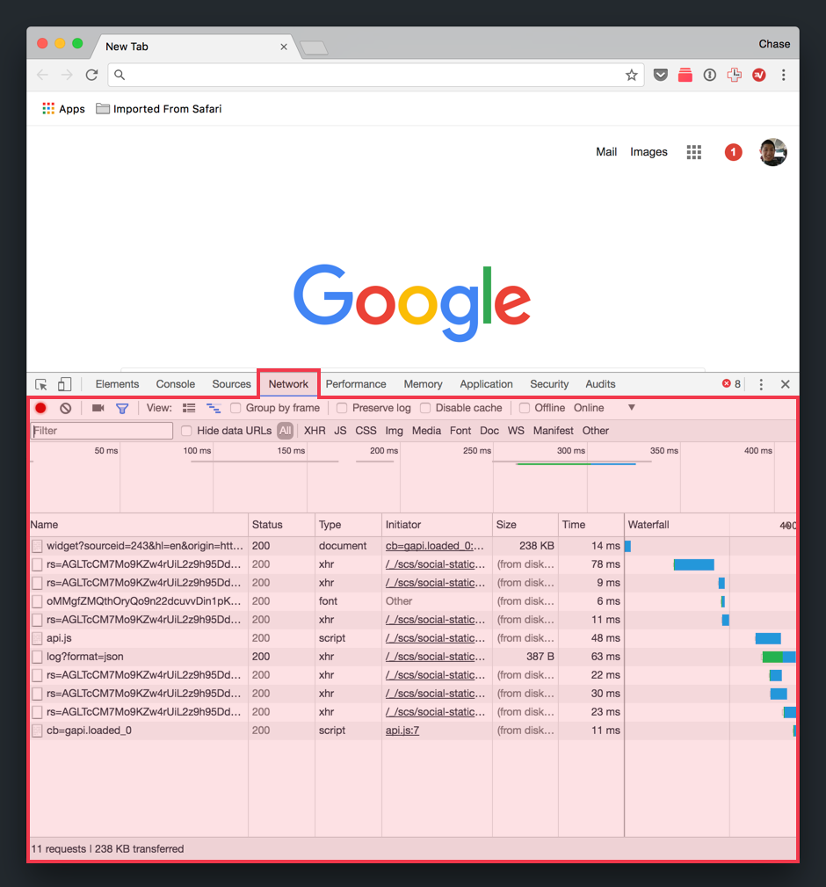
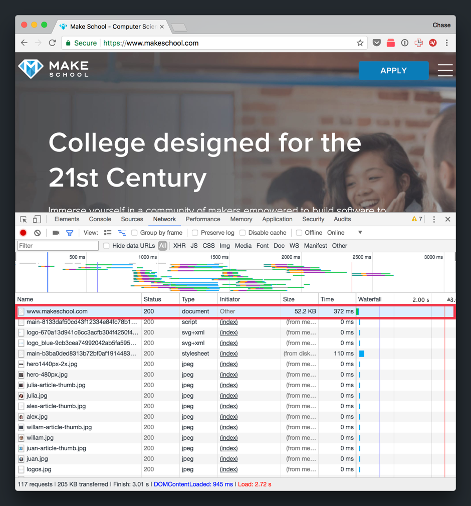
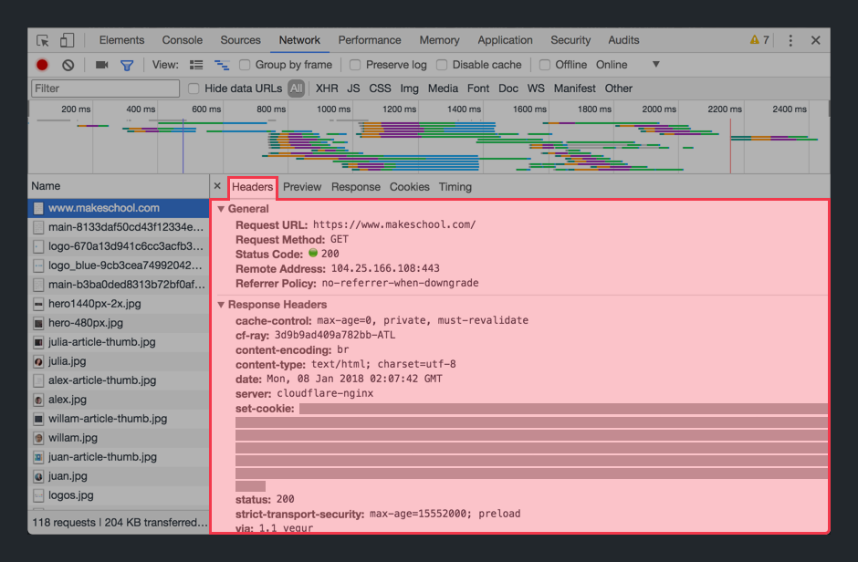
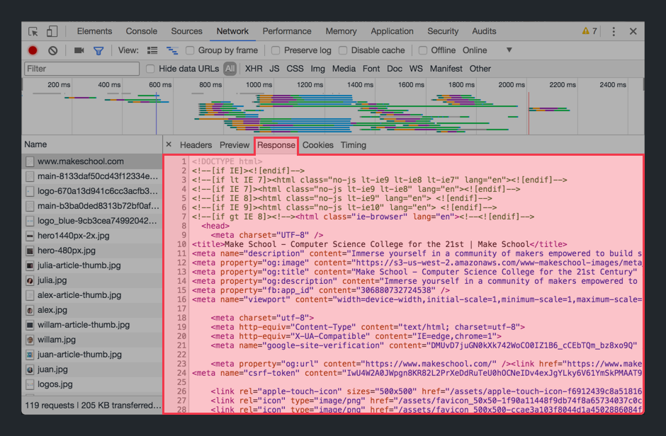
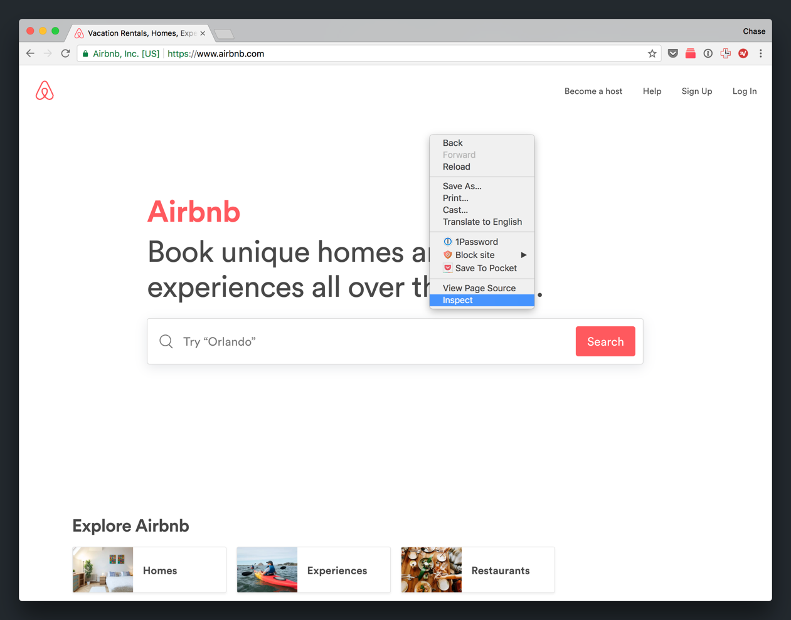
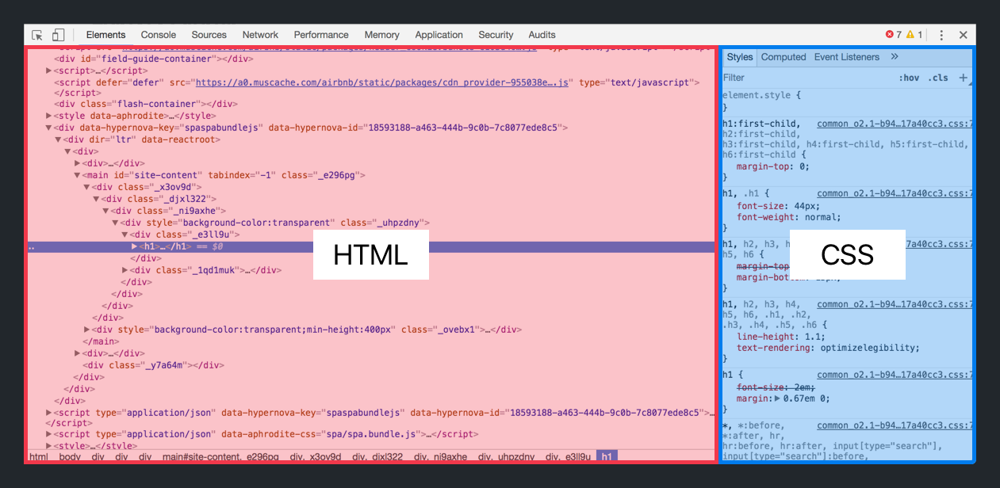
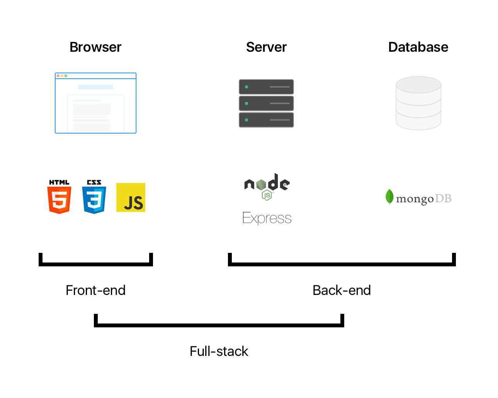

In the previous section, we got a high-level overview of how the internet works. We'll move forward by looking at this process up close. More specifically, we'll use the _Chrome Developer Tools_ to look at the HTTP request being sent to the server, the HTTP response sent back to the client, and finally the code that the browser renders to display each web page that you use.

We'll focus on steps 1, 2, 5 and 6 above.

Roll up your sleeves–let's dive into the dirt!

# Opening the Developer Tools

The Chrome Developer Tools (DevTools for short), are a set of tools that are built into Google Chrome. These DevTools provide web developers with a easy way to view, test and debug their front-end code.

First, let's learn how to access the DevTools.

> [action]
>
Open a _New Tab_ page in your Google Chrome web browser. You should see the following:
>

Next, find your operating system and following the corresponding instructions to open the DevTools.

## Open DevTools

> [action]
Open DevTools on macOS:
>
1. After opening a _New Tab_ in your browser, navigate to the _Menu Bar_ on the top left corner of your screen. 
1. In the _App Menu_, navigate to the following: View > Developer > Developer Tools. 
1. Confirm that you see the DevTools window in the bottom pane of your browser. 

<!--  -->

> [info]
>
An easy shortcut you can use to open the DevTools is by pressing 'CMD + Option + i' (or 'Ctrl + Shift + i' on Windows).

# HTTP Request/Response Cycle in Action

If you recall from the previous section, when we type a URL into our web browser and hit enter, the browser will send a HTTP request to the correct web server and will eventually receive a HTTP response back from that server. Let's see what the _HTTP request/response cycle_ looks like in real-time.

> [info]
>
The _HTTP Request/Response cycle_ is another way to refer to the process that happens when a client (browser, tablet, phone) communicates with a web server with HTTP requests/responses.

Let's setup our DevTools window to observe the HTTP request/response cycle.

> [action]
>
With your DevTools Window open, navigate to the _Network_ tab in the toolbar at the top of the DevTools window. 

Using the _Network_ tool, we can observe and log all HTTP requests and their corresponding responses. By default, DevTools automatically records all network traffic when the DevTools window is open. This is denoted by the red _Record Network Log_ button.

Let's look at what sending HTTP requests look like.

> [action]
>
Type the Make School URL `www.makeschool.com` into address bar and hit _Enter_.
>
Pay attention and watch the _Network_ panel as the HTTP requests are sent and their responses are received in real-time. 

Using the _Network_ tool, we can examine specific HTTP requests. Let's look at one up close.

> [action]
>
In the _Network_ panel, complete the following:
>
1. Under the _Name_ column, find the request named `www.makeschool.com` and click on it. You might have to scroll up to the top of all of the _Name_ column. 
>
You should see another panel pop out with more information about the specific HTTP request: 

<!-- break -->

> [action]
>
In the pop out of the `www.makeschool.com` request, click on the _Headers_ tab. If you scroll down (or expand the DevTools window), you'll be able to see some of the information that was sent along with the HTTP request/response. 
>
When you're done looking at the _Headers_, switch to the _Response_ tab. Here, you'll see the code in the HTTP response that was returned from the web server back to the browser. As you can see, this is the code was rendered by your browser and turned into the web page that you're look at now! 

Pretty cool huh? We were able to peer into the actual HTTP request/response that was sent after we typed `www.makeschool.com` into the address bar and hit _Enter_. When you're finished, close the DevTools window.

# A Web Page (Under the Hood)

Each web page is made of HTML, CSS and JavaScript. Just now, we learned how to examine the outgoing and incoming network traffic. Next, we'll learn how to look at the HTML, CSS and JavaScript that's used by the browser for any given web page.

insert diagram here of html css js ??

> [action]
To look at the code that the browser renders:
>
1. Open a New Tab and go to `www.airbnb.com`. 
1. Right-click anywhere in the web page and click on the option to _Inspect Element_. 
>
You should see the DevTools window appear on the _Source_ tab. 
>
On the left of the _Source_ panel, you'll see the HTML of the web page. On the right, you'll see the CSS styles applied to each HTML element. 
>
If this doesn't make much sense to you yet, don't worry. We'll go more in-depth on how HTML, CSS and JavaScript work together in the next two tutorials. The main takeaway is that you can look at the code (HTML, CSS and JavaScript) that the browser uses to render each web page.

> [challenge]
>
Open a 'New Tab' and navigate to your personal favorite website. Repeat the steps above to inspect the source code of that website!
>
Using the _Source Inspector_ is an easy way to see the code of other developers and how they decided to build websites.

# A Quick Review

In this section, we were introduced to the _Chrome Developer Tools_ and learn some of it's basic funtionalities. The two tools we looked at were the _Network_ tool and the _Source Inspector._

> [challenge]
>
Do you remember what each tool is used for?

<!-- break -->

> [solution]
>
- *Network tool*: Record and monitor requests and resources that are downloaded over the internet. We can use the _Network_ tool to observe network traffic in real-time.
- *Source Inspector*: View the underlying HTML, CSS and JavaScript code of a website. We can use the _Source Inspector_ to view and debug our front-end code for our web pages.

<!-- break -->

> [info]
>
The DevTools have many more tools and functionality that are out of the scope of this tutorial. As you advance as a web developer, you'll continue to learn more about the DevTools and how to use them to view, test and debug our front-end code.

These tools will become especially useful as we learn front-end development.

> [challenge]
>
Do you remember which technologies we'll use in the front-end?

<!-- break -->

> [solution]
>
We'll build our front-end with HTML, CSS and JavaScript. We'll learn more about each technology and what it's used for in the next tutorial.
>

We've covered a lot of ground and important concepts so far. Take a moment to let these new ideas soak into your brain before continuing to the next section.
